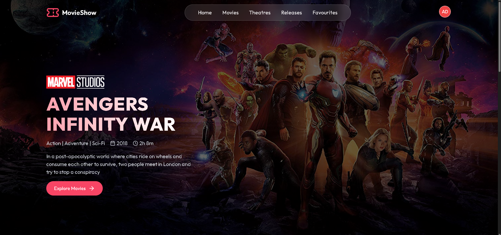
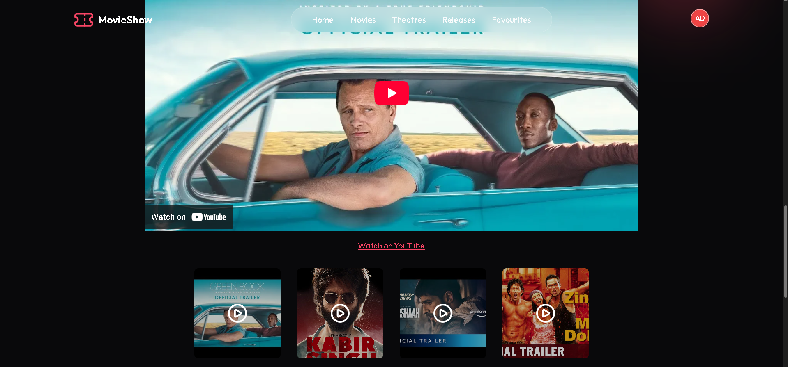
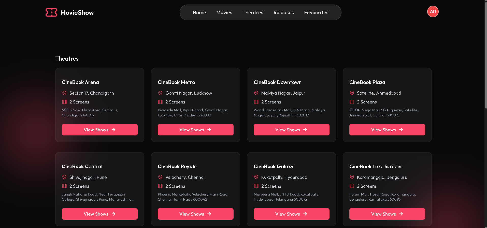
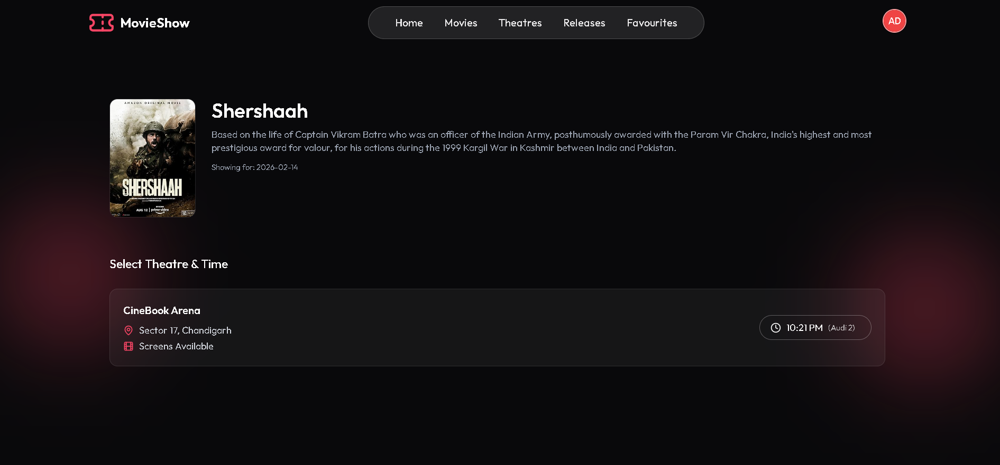
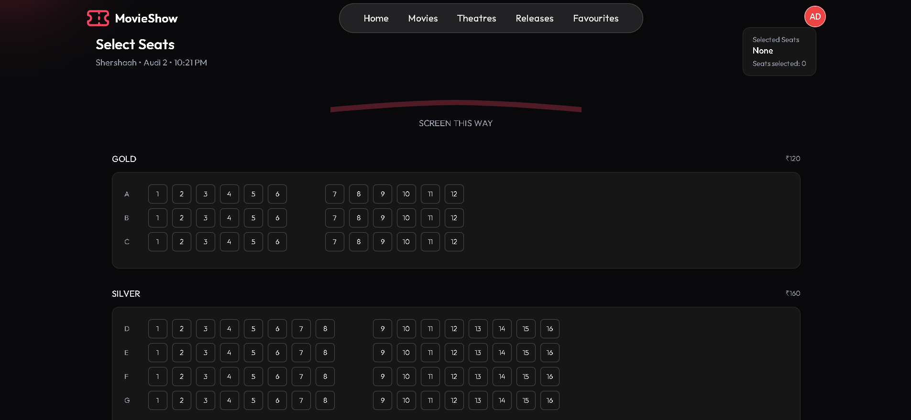

# 🎬 Full Stack Movie Ticket Booking Platform (BookMyShow Clone)

A **production-ready full stack movie ticket booking system** built using modern web technologies.  
Users can browse movies, select theatres, choose seats, and book tickets securely with real-time availability.

Designed with **real-world backend architecture**, authentication, concurrency handling, and scalable database modeling.

[](https://movie-booking-website-s7hi.vercel.app/)

---

# 🚀 Tech Stack

## Frontend
- React.js
- React Router
- React Query (TanStack Query)
- Tailwind CSS
- Lucide Icons

## Backend
- Node.js
- Express.js
- Prisma ORM
- PostgreSQL
- Redis (seat locking & expiry)
- JWT Authentication
- Cookie-based sessions
- Stripe Payments

---

# ✨ Core Features

## 🎟️ Smart Booking System
- Real-time seat availability
- Seat locking using Redis (prevents double booking)
- Booking expiry timer
- Grace period after show start
- Max seat limit per user
- Backend validation for concurrency safety

## 💳 Payments
- Stripe secure payment integration
- Payment verification before confirmation
- Booking created only after successful payment

## 📩 Ticket Confirmation
- Email confirmation after booking
- Ticket details sent automatically
- Printable ticket support
- Download / print ticket option

## 🔐 Authentication & Security
- JWT Authentication
- HTTP-only cookie-based sessions
- Role-based authorization (User/Admin)
- Protected API routes
- Secure backend validations
- Google auth

## 👨‍💼 Admin Panel
Admin can:
- Add movies
- Add theatres
- Create screens
- Design seat layouts (rows, sections, pricing)
- Create shows
- Manage bookings

## 🎥 Movie & Show Browsing
- Filter by date
- Theatre-wise grouping
- Show start / running / ended detection
- Only valid shows displayed

## 🎨 UI/UX
- Responsive layout
- Clean modern design
- Loading states
- Disabled seats visualization
- Smooth seat selection

 ## 💳 Payments & Security

- Stripe payment integration
- Secure checkout flow
- Stripe Webhooks for payment verification
- Backend signature validation
- Booking confirmed only after verified payment
- Prevents fake or client-side payment manipulation

# ⚡ Production-Grade Highlights

- Redis seat locking (no double booking)
- Idempotent booking APIs
- Stripe webhook verification
- Optimistic concurrency control
- Cursor-based pagination
- Server-side validation only
- Prisma relational modeling
- Secure cookies (HTTP-only)
- Clean MVC backend structure

---

# 🏗️ Architecture

React (UI)
   ↓
Express API
   ↓
Redis → temporary locks
   ↓
PostgreSQL → final booking storage
   ↓
Stripe


---

# 🖼️ Screenshots

## 🏠 Home Page
Browse trending and featured movies with modern UI.


---

## 🎬 Movie Details Page
View movie info, rating, trailer, and book tickets.


---

## 🎥 Trailer Section
Watch official trailers with embedded player.


---

## 🏢 Theatres Listing
Browse theatres city-wise with screens info.


---

## 🕒 Theatre Shows & Time Selection
Select theatre and available show timings.


---

## 💺 Seat Selection Page
Interactive seat layout with real-time locking & booking.


---

## 💺 Admin Page
Beautiful admin dashboard to see the show


---

## 💺 Admin add show
Admin can add show with threater screen and time


---

# ⚙️ Installation Guide

## 1️⃣ Clone repository
```bash
git clone https://github.com/yourusername/movie-booking-platform.git
cd movie-booking-platform
```

---

## 2️⃣ Backend Setup
```bash
cd backend
npm install
```

Create `.env` file:

```
DATABASE_URL=your_postgres_connection_string
JWT_SECRET=your_secret_key
REDIS_URL=your_redis_url
STRIPE_SECRET_KEY=your_stripe_key
PORT=3000
```

Run:
```bash
npm start
```

---

## 3️⃣ Frontend Setup
```bash
cd view
npm install
npm run dev
```

---

# 🔐 Environment Variables


Use `.env.example`:

```
DATABASE_URL=
JWT_SECRET=
REDIS_URL=
STRIPE_SECRET_KEY=
PORT=
```

---

# 📚 What I Learned

This project helped me understand:

- Scalable backend architecture
- REST API design
- Prisma database modeling
- Concurrency handling (seat locking)
- Authentication & authorization
- Secure cookie-based sessions
- Payment integration
- Production-grade booking logic
- Performance optimization with caching

---


# 👨‍💻 Author

**Aditya Ankur**  
Full Stack Developer  

Open to internships & full-time opportunities 🚀

If you like this project, give it a ⭐

---
Admin:
Email: admin@gmail.com  
Password: admin123
# 🔎 Keywords (for recruiters)

Full Stack • React • Node.js • Prisma • PostgreSQL • Redis • JWT • Stripe • Booking System • Authentication • Admin Panel • REST APIs
