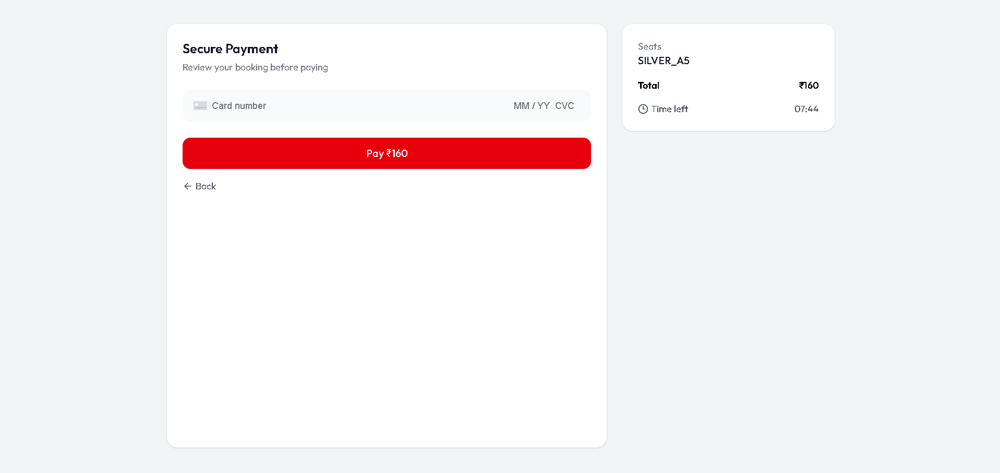
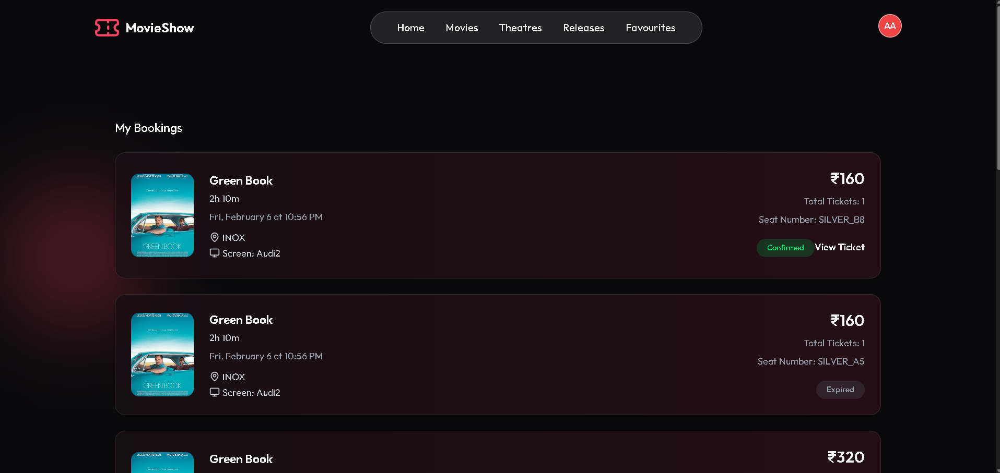
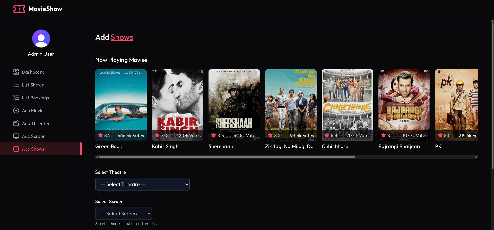

# 🎬 Movie Booking Platform

### Full Stack Movie Booking Website

A **production-ready movie ticket booking application** built with real-world backend architecture and scalable frontend design.

Users can browse movies, select threaters , add favourites, select seats, and book tickets securely with real-time availability.

Built with **Redis seat locking, optimistic concurrency control, Stripe payments, JWT authentication, Google OAuth, role-based access control, and an Admin dashboard** — similar to how large ticketing platforms actually work.

---

## 🔗 Live Demo

👉 https://movie-booking-website-s7hi.vercel.app

---

## 📸 Screenshots






---

## ⚡ Tech Stack

Frontend: React • React Router • React Query • Axios • Tailwind CSS  
Backend: Node.js • Express • Prisma • PostgreSQL • Redis  
Auth: JWT • Google OAuth  
Payments: Stripe Checkout • Stripe Webhooks  

---

## 🔥 Core Features

### 🎟 Booking
- Interactive seat selection
- Real-time availability
- Redis temporary seat locks
- Optimistic DB locking
- Prevents double booking
- Auto lock expiry
- Email confirmation
- Print Ticket
 
### 🔐 Authentication
- JWT login/signup
- Google OAuth
- Protected routes

### 💳 Payments
- Stripe checkout integration
- Secure payments
- Webhook verification
- Booking confirmed only after payment success

### 👑 Role Based Access (RBAC)
User:
- Browse & book tickets
- View bookings

Admin:
- Add movies
- Manage theatres
- Manage screens & seat layouts
- Create shows & timings
- Track bookings & revenue

### 🚀 Performance
- React Query caching
- Pagination
- Redis caching
- Optimized APIs

---

## 🧠 Booking Flow

Seat Select → Redis Lock → Postgress DB ->Payment → Webhook Confirm → Booking Saved

Prevents race conditions, double booking, and payment fraud.

---

## 🚀 Run Locally

```bash
git clone https://github.com/adityaankur5373-adi/Movie-Booking-Website.git
cd Movieshow

create .env 

DATABASE_URL=
REDIS_URL=
JWT_SECRET=
STRIPE_SECRET_KEY=
STRIPE_WEBHOOK_SECRET=
GOOGLE_CLIENT_ID=
GOOGLE_CLIENT_SECRET=


# backend
cd backed && npm install && npm start

# frontend
cd view && npm install && npm run dev
